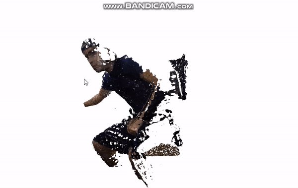

# 3D Environment Reconstruction Using Azure Kinect

The goal of this project is to reconstruct a 3D environment using two or more Azure Kinect devices and then use that environment to train an agent using reinforcement learning algorithms.



The basic steps are:
  1. Calibrate devices so we can have a unified coordinate system.
  2. Capture synchronized frames in unified coordinate system and generate point clouds from them.
  3. Use Open3D library to reconstruct meshes from point coulds using either Ball Pivoting or Poisson algorithm.

## Code Structure

This project consists of two modules. 
  - First module is a C++ program for working with Azure kinect devices, capturing frames and generating and saving point clouds to disk.
  - Second module is a python program for reading point clouds and reconstrcuting meshes using Open3D library.

## Required Libraries

  - The C++ module requires [OpenCV](https://opencv.org/releases/), [Azure Kinect library](https://docs.microsoft.com/en-us/azure/kinect-dk/set-up-azure-kinect-dk), [CMake](https://cmake.org/install/) and [Ninja](https://github.com/rwols/CMakeBuilder/wiki/Ninja-for-Windows-Installation-Instructions) to be installed to build.
  - The python module requires numpy, matplotlib and Open3D which can be installed by following command via pip:
`pip install numpy matplotlib open3d`

## Compile Instructions

The C++ module needs to be compiled in order to create a executable file. To do that you need to have cmake. If you are on Windows and have Visual Studio installed, you can open "Native tools command prompt for VS" and run the following commands in `camera_service`
 directory:
 ```
 > mkdir build && cd build && cmake -G Ninja ..
 > ninja
 ```
 (Note: you might need to change the paths of OpenCV and Azure Kinect libraries in `CMakeLists.txt` based on your installation)
 
## A Note on Calibration (from "Green Screen" example in Azure Kinect SDK)

This program relies on transforming the backup camera's depth image into the color camera's space. This transformation requires knowing the transformation between the two cameras. To find that transformation, we must calibrate the cameras.
This program relies on OpenCV's chessboard calibration functions. As a result, you should have a chessboard pattern to use while calibrating the cameras. If you don't have one, print one out. You can find a 9x6 one
[here](https://docs.opencv.org/2.4/_downloads/pattern.png) (note that the 9x6 comes from the interior corners, not the number of squares). The example requires the calibration board to be in view for both devices' color cameras for many frames, so make sure it's visible to both cameras.

Checked into this folder is chessboard.png. It is 10 x 7. To OpenCV it is 9 x 6 and 22 mm if printed in landscape, at 100%, and with normal margins. on diferent platforms the printing experience can be different. When printing from the Mac, choose "print entire image" option.

Also, DO NOT move the cameras during or after calibration! Changing that translation will cause the backup camera to provide inaccurate information.

## Running the program

To start cameras, run the `camera_service.exe` executable in the `camera_service/build` folder with no arguments for usage details and defaults, and then fill in any customizations you might need.

The first option is the number of cameras you need. The next three options are for the calibration (if you use our recommended board, you want those to be 9, 6, and (length of an individual calibration square side, in millimeters). If you're only using a single camera, those numbers don't matter, although for validation they should be nonzero. 1 1 1 should be fine.

The rest of the options aren't required. Run the example with no argument for details. In particular, you can change the cutoff threshold distance.

To process the saved point clouds and reconstruct environment, run `main.py` in the `environment_builder` folder with following commad:
`python main.py`

## Potential reasons for failure

- If you're having weird runtime errors, sometimes disconnecting and reconnecting the cameras can help.

- The range of the depth camera is limited and depends on the depth mode. You may need to change the depth mode depending on how far you need to have your cutoff. See [here](https://docs.microsoft.com/en-us/azure/Kinect-dk/hardware-specification) for the specs.

## Refrences

[Green Screen example in Azure Kinect SDK](https://github.com/microsoft/Azure-Kinect-Sensor-SDK/tree/develop/examples/green_screen)
